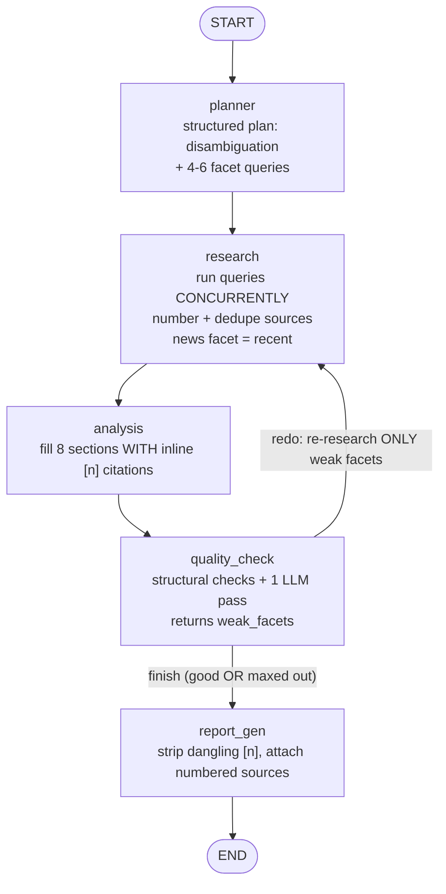

# Architecture

## Overview

Zylabs Research Copilot is a three-tier application: a Next.js frontend, a
FastAPI backend, and a multi-step LangGraph AI workflow, backed by a relational
database (SQLite locally, Postgres in production).

```
┌─────────────────────────────────────────────────────────────┐
│  FRONTEND (Next.js · TypeScript · Tailwind · shadcn/ui)      │
│  Home (create + history) · Detail (progress, report, chat)  │
│  Inter font · markdown rendering · inline [n] citations     │
└───────────────────────────┬─────────────────────────────────┘
                            │  HTTP (JSON) + SSE
                            ▼
┌─────────────────────────────────────────────────────────────┐
│  BACKEND (FastAPI)                                           │
│  api/sessions  ·  api/workflow  ·  api/chat                  │
│  services/runner   services/chat                            │
└──────────────┬───────────────────────────┬──────────────────┘
               │                            │
               ▼                            ▼
┌──────────────────────────┐   ┌────────────────────────────────┐
│  AI WORKFLOW (LangGraph) │   │  STORAGE (SQLAlchemy)          │
│  planner → research →    │   │  sessions · reports            │
│  analysis → quality →    │   │  workflow_steps · chat_messages│
│  report_gen  (+ loop)    │   │  SQLite (dev) / Postgres (prod)│
│      │                   │   └────────────────────────────────┘
│      ├─► OpenAI (LLM)    │
│      └─► Tavily (search) │
└──────────────────────────┘
```

Deployment: the frontend runs on Vercel, the backend on Render, and the
production database is Neon Postgres. CORS on the backend is restricted to the
known frontend origins.

## Layers

### Frontend — Next.js (React) + TypeScript + Tailwind + shadcn/ui
A React app on the Next.js App Router with two routes: the home page (session
creation form + history list, with per-row delete) and the session detail page
at `/sessions/[id]` (live workflow progress, the structured report, and a
follow-up chat panel). A typed API client (`lib/api.ts`) with shared types
(`lib/types.ts`) mirrors the backend schemas so the frontend/backend contract is
checked at compile time. Tailwind + shadcn/ui provide the component system, the
UI uses the Inter typeface, and report sections and assistant chat replies are
rendered as Markdown (bold, lists, headings) with inline `[n]` markers turned
into superscript links to the matching source. The interactive pieces (SSE
progress stream, chat) are client components reaching the backend over HTTP/SSE
via `NEXT_PUBLIC_API_BASE`. Next.js's server/API features are intentionally
unused because the assignment mandates a separate FastAPI backend.

### Backend — Python + FastAPI
FastAPI exposes a small REST API organized around the research session resource.
It was chosen for its first-class async support (important for the SSE progress
stream), automatic request validation via Pydantic, and auto-generated API docs.
Business logic lives in a thin service layer (`services/runner.py`,
`services/chat.py`) so the route handlers stay simple.

### AI Workflow — LangGraph + LangChain
The core of the product. A `StateGraph` threads a shared `GraphState` through
five nodes with a conditional quality-retry loop. LangGraph makes the multi-step
process explicit, supports conditional routing, and exposes intermediate outputs
we can stream. LangChain provides the LLM abstraction, structured output
(Pydantic), and the Tavily search integration.

### Storage — SQLAlchemy (SQLite / Postgres)
SQLAlchemy maps four tables (sessions, reports, workflow_steps, chat_messages)
to Python objects, with cascade deletes so removing a session cleans up its
report, steps, and messages. SQLite is the zero-setup local store; production
uses Neon Postgres. The database layer is portable: it normalizes `postgres://`
URLs to `postgresql://`, applies `check_same_thread=False` only for SQLite, and
enables `pool_pre_ping` for managed Postgres (which may drop idle connections).
Switching environments is a single `DATABASE_URL` change.

## API / System Interface

| Method   | Path                          | Purpose                                  |
|----------|-------------------------------|------------------------------------------|
| `POST`   | `/api/sessions`               | Create a research session                |
| `GET`    | `/api/sessions`               | List sessions (history, newest first)    |
| `GET`    | `/api/sessions/{id}`          | Session detail (report + steps)          |
| `DELETE` | `/api/sessions/{id}`          | Delete a session (cascade)               |
| `POST`   | `/api/sessions/{id}/run`      | Start the workflow (background thread)    |
| `GET`    | `/api/sessions/{id}/stream`   | SSE stream of live workflow progress     |
| `GET`    | `/api/sessions/{id}/report`   | Fetch the finished report                |
| `POST`   | `/api/sessions/{id}/chat`     | Ask a grounded follow-up question        |
| `GET`    | `/api/sessions/{id}/chat`     | Fetch chat history                       |

## AI Workflow (detail)



Research facets the planner spreads queries across:
`overview_products`, `customers`, `funding`, `leadership_hiring`, `news`,
`competitors_risks`.

## Data Flow (user input → final report)

1. The user submits the create-session form. The frontend calls
   `POST /api/sessions`, which stores a session row (`status = pending`).
2. The frontend immediately calls `POST /api/sessions/{id}/run`. The backend
   starts the LangGraph workflow in a background thread and returns right away.
3. The workflow runs node by node, each reading and updating the shared state:
   - **planner** emits a structured plan: a one-line disambiguation (using the
     website to avoid same-name confusion) plus 4-6 targeted facet queries.
   - **research** runs those queries concurrently (thread pool), merges and
     de-duplicates sources by URL, numbers them `[1], [2], …`, and uses a
     recency-biased search for the `news` facet (so signals favor fresh events).
   - **analysis** uses an LLM with structured output to fill the 8 report
     sections, adding inline `[n]` citations that reference real source numbers.
   - **quality_check** runs cheap structural checks (empty/thin sections,
     citations present) plus one LLM verdict, and reports which facets are weak.
   - On a weak verdict (and under the retry cap) the graph routes back to
     **research**, which re-researches only the weak facets (a cheaper, targeted
     redo) rather than repeating everything.
   - **report_gen** strips any `[n]` markers that don't map to a real source and
     attaches the numbered sources.
   Each node persists a `workflow_step` row as it completes.
4. The frontend opens an SSE connection to `GET /api/sessions/{id}/stream`,
   which reads new steps from the database and pushes them to the browser live.
5. On completion the report is saved (`reports` table) and the session is marked
   `completed`. The frontend fetches and renders the report as formatted
   Markdown with clickable citations and a numbered, dated source list.
6. Follow-up questions hit `POST /api/sessions/{id}/chat`. The chat service
   rebuilds the message list (system prompt + report context + prior turns + the
   new question), calls the LLM (instructed to answer in Markdown), and persists
   both messages.

## State Shape (LangGraph)

`GraphState` carries:
- inputs: `company`, `website`, `objective`
- planner output: `disambiguation`, `queries` (list of `{facet, query}`), `plan`
- research output: `research_notes` and `sources` (numbered objects
  `{n, title, url, facet, date}`)
- analysis output: `report` (the 8 sections, later plus `sources`)
- quality-loop control: `quality_ok`, `quality_feedback`, `weak_facets`,
  `attempts`
- observability: an append-only `steps` log (using an `operator.add` reducer)
  and an `error` field

## Reliability & Recoverability

- Every node is wrapped in `try/except`; a failure records an error in the state
  and a `failed` step rather than crashing the run.
- The quality loop is bounded by `MAX_ATTEMPTS`, so it can never loop forever.
- Research merges and de-duplicates sources across retries, so a poor redo can
  never wipe out good results from an earlier pass; source numbering is stable.
- Individual search queries are isolated — one failing query doesn't abort the
  whole research node.
- The workflow runner catches crashes and marks the session `failed` with the
  error message, which the UI surfaces.

## Notable Tradeoffs & Constraints

- **Background thread vs. task queue.** The workflow runs in a Python thread for
  simplicity. Fine for a single instance, but horizontal scaling would need a
  real task queue (e.g. Celery/RQ).
- **SSE-over-database.** Progress is streamed by polling the DB rather than an
  in-memory pub/sub. Simple and restart-safe, at the cost of small latency and
  some DB reads.
- **Cost/latency of deeper research.** Multi-query research issues several Tavily
  calls per report (run concurrently) plus the same LLM passes; the targeted
  redo keeps retries from repeating all research. This trades higher per-report
  cost for materially better depth, accuracy, and verifiability.
- **Quality judge.** Quality combines cheap structural checks with one LLM pass.
  It is more deterministic than a pure LLM verdict but still adds a call; the
  thresholds and retry cap are tunable.
- **SQLite vs. Postgres.** SQLite serializes writes (great for dev, single
  node); production uses Postgres for real concurrency.
